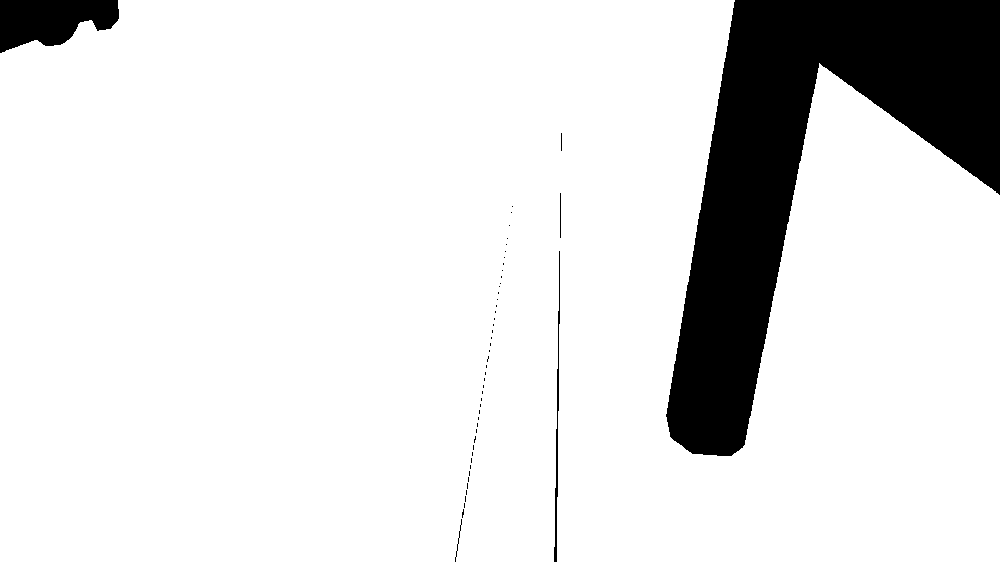
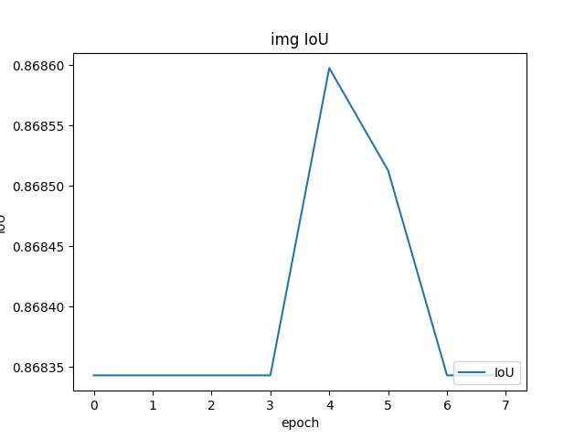
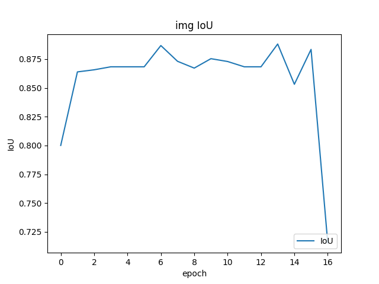
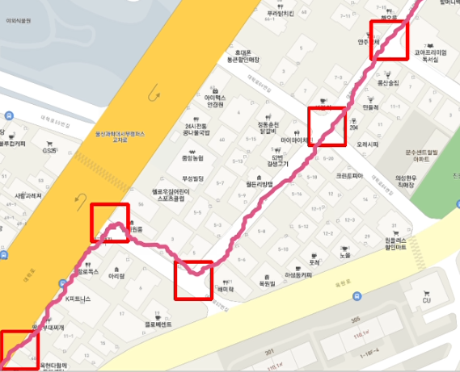

# AIFFELTON Tayo Team
자율주행로봇을 만들기 위해.  


## 목차
1. [동기](#동기)
2. [ROOT Directory](#root-directory)
3. [SEGMENTATION TRAIN](#segmentation-train)
4. [H/W](#h/w)
5. [F/W](#f/w)
6. [S/W(로컬 컴퓨터)](#s/w_local)
7. [S/W(원격 컴퓨터)](#s/w_remote)
7. [RESULT](#result)
----------


## 동기
- 최근 3년동안 코로나19로인한 팬데믹으로 우리나라 뿐만아니라 일본, 동아시아 ,유럽등 많은 딜리버리 서비스를 이용하는 추세로 인력이 아닌 장애물을 피할수있고 안전하게 가져다주는 딜리버리 로봇이 보편화되면 산업시장이 더욱 활발해지고 사용자의 편리함을 추구할것같아 자율주행로봇을 개발 해보려고 한다. 
----------


## ROOT Directory
```
.
├── Atmel/
├── CAD/
├── circuit/
├── doc/
├── imgs/
├── QGIS/
├── self_d_python/
└── source/
```

각 폴더에 대한 개요입니다:

| 폴더 | 설명 |
| -------- | ----------- |
| `Atmel` | GPS, IMU, XM430-W210-T(모터), Atmega2560을 제어하기 위한 Atmel 소스 |
| `CAD` | 모델링 이미지, STL |
| `circuit` | F/W를 제어하기 위한 회로도 |
| `doc` | 참고한 데이터셋, 자료 |
| `QGIS` | 원격 컴퓨터에서 로봇의 현재 상태를 파악할 수 있게 한 PYQGIS |
| `source` | SEGMENTATION TRAIN을 위한 소스 |
----------


## SEGMENTATION TRAIN
### 1. DIRECTORY TREE
```
.
├── checkpoint/
├── data/
├── data_processing/
|	├── data_download.py
|	├── data_loader.py
|	└── data_processing.py
├── img/
|	├── test_input/
|	├── test_output/
|	└── test_evaluate/
├── models/
|	├── deeplab_v3.py
|	├── fcn.py
|	├── pspunet.py
|	├── pspunet_vgg16.py
|	└── unet.py
├── predict/
|	└── test.py
├── train/
|	└── train.py
├── utils/
|	└── INNORIX-EX-Agent.exe
├── config.ini
├── main.py
└── requirements.txt
```

각각의 것들에 대한 개요입니다:

| 폴더, 파일 | 설명 |
| -------- | ----------- |
| `checkpoint/` | 학습 중 val_loss가 가장 낮은 가중치 저장 |
| `data/` | SEGMENTATION DATASET 저장 |
| `data_processing/` | - |
| `data_download.py` | AI HUB 인도 데이터셋 data폴더에 다운로드, 다운로드 폴더 처리 |
| `data_loader.py` | - 이미지를 tensorflow dataset으로 변환  process(normalization, resize, split) </br> - augment(random_brightness, clip_by_value) </br> - configure for performance(tf.dataset repeat, batchsize, prefetch) |
| `data_processing.py` | - MASK이미지 원하는 라벨(config.ini) binary분류 </br> - RGB → GRAY |
| `img/` | - |
| `test_input/` | test하고 싶은 이미지 저장 |
| `test_output/` | test_input/ 이미지를 test한 mask이미지 저장 |
| `test_evaluate/` | 학습 중 제대로 학습 중인지 확인을 위한 이미지 저장 |
| `models/` | - 모델 구현 </br> - 학습된 모델(.h5) 저장  |
| `predict/test.py` | - test하기 위한 모델 불러오기 </br> - test 이미지 전처리 및 test |
| `train/train.py` | - 학습을 위한 optimizer, loss등 설정 </br> - callback 설정 |
| `utils/` | - AI HUB 데이터셋을 다운로드 받기 위한 설치 파일 |
| `config.ini` | - 이미지 사이즈, EPOCHS, batch size 설정값 저장 </br> - MASK DATA를 binary로 나누기 위한 라벨 설정 |
| `requirements.txt` | 학습, 다운로드등을 하기 위한 모듈 버전 |

### 2. PROGRESS
#### a. DATA DOWNLOAD
- AI HUB 인도 데이터셋 다운로드 받기.
    1. selenium을 이용해 AI HUB 접속
    2. config.ini에 저장해놓은 AI HUB 아이디, 비밀번호로 로그인
    3. 다운로드
    4. 압축 해제
    
#### b. DATA PRE-PROCESSING
- MASK이미지(RGB)를 원하는 라벨에 맞게 GRAY로 변경
    1. data/에 있는 MASK 이미지 로드
    2. config.ini에 저장해놓은 원하는 라벨 정보 받기
    3. 원하는 라벨은 255 그 외는 0으로 처리

    input             |  output
    :-------------------------:|:-------------------------:
      |  

#### c. DATA LOAD
- 이미지들을 tensorflow dataset에 맞게 변경
    1. data/에 있는 IMG(RGB), MASK(GRAY) 이미지 로드
    2. 데이터 셔플
    3. 데이터 split(train, validation, test)
    4. augment (random brightness, clip by value)
    5. configure for performance (batch)

#### d. TRAIN
- 구성한 model(unet등)을 통해 학습
    1. model 불러오기
    2. Callback 설정
        - 매 에폭이 끝나면 test 이미지를 predict해 저장
        - 매 에폭이 끝나면 IoU 계산
        - checkpoint
        - early stopping
    3. loss 그래프 저장

#### TRAIN RESULT
- hyper parameter
    - IMG WIDTH = 320
    - IMG HEIGHT = 192
    - BATCH SIZE = 4
- test img


- unet
    - test dataset fps = 172.9
    - Mean IoU = 0.776
    - real fps = 50.9

loss             |  IoU
:-------------------------:|:-------------------------:
  |  
val_input             |  vaLmask
  |  
train validation             |  


test output             |  test blend
:-------------------------:|:-------------------------:
  |  

- pspunet
    - test dataset fps = 174.08
    - Mean IoU = 0.970
    - real fps = 35.9

loss             |  IoU
:-------------------------:|:-------------------------:
  |  
test output             |  test blend
  |  

- pspunet_vgg16
    - test dataset fps = 166.9
    - Mean IoU = 0.899
    - real fps = 34.11

loss             |  IoU
:-------------------------:|:-------------------------:
  |  
test output             |  test blend
  |  

- deeplab_v3
    - test dataset fps = 164.33
    - Mean IoU = 0.6421
    - real fps = 14.76

loss             |  IoU
:-------------------------:|:-------------------------:
  |  
test output             |  test blend
  |  

- fcn
    - test dataset fps = 117.09
    - Mean IoU = 0.7842
    - real fps = 51.88

loss             |  IoU
:-------------------------:|:-------------------------:
  |  
test output             |  test blend
  |  

- performance table by model 

    | model | test dataset IoU | real fps |
    | -------- | ----------- | ----------- |
    | `unet` | 0.776 | 50.9 |
    | `pspunet` | 0.970 | 35.9 |
    | `pspunet_vgg16` | 0.899 | 34.11 |
    | `deeplab_v3` | 0.6421 | 14.76 |
    | `fcn` | 0.7842 | 51.88 |
----------

## H/W
- Autodesk Inventor를 통해 모델링
- 3D 프린터, 외주를 통해 제작

MODELING             |  REAL
:-------------------------:|:-------------------------:
  |  

- 응력 해석
    
----------


## F/W
- 모터, GPS, IMU 제어
    1. initialize
        - UART0(노트북 Serial), UART1(모터), UART2(GPS), I2C(IMU) init
        - IMU (acc, gyro, mag) 보정
    2. Timer 240ms마다 IMU 데이터 파싱
        - 지자기 센서를 통해 COMPASS 각도 계산
        - UART0을 통해 COMPASS 각도 데이터 전송
    3. Timer 500ms마다 GPS 데이터 파싱
        - GNRMC에서 좌표, 각도, 속도 파싱
        - UART0을 통해 GPS 좌표 데이터 전송
    4. UART0을 통해 모터 속도 데이터 수신
        - 모터 속도 제어

- 블럭도
    
- 회로도
    - ATMEGA
        
    - POWER
        
    - SERIAL
    
----------


## S/W LOCAL
- 로봇 위에 연결된 컴퓨터
- F/W에서 받은 데이터(GPS, degree)를 SQL서버에 전송 및 받기
- Lidar data 처리
- Segmentation 처리
    1. Lidar, F/W간 Serial 통신 연결 확인 및 카메라 연결 확인
    2. initialize
        - Lidar 데이터 파싱 시작 및 멀티 프로세싱 시작
            - Lidar 멀티 프로세싱(Serial data -> distance, angle)
        - 카메라를 통해 받은 이미지를 segmentation시작 및 멀티 프로세싱 시작
            - segmentation 멀티 프로세싱(resize, evaluate, 방향찾기)
        - SQL서버(GPS DATA, GPS WAYPOINT DATA) 초기화
        - compass각도 보정
    3. Lidar 전처리된 데이터를 통해 로봇이 갈 수 있는길인지 판단
        - Lidar 전방을 기준으로 40도씩 5곳을 확인
        
    4. a star 알고리즘을 통해 로봇이 실제로 갈 수 있는 길 확인
    5. F/W에게 모터 속도 전송
    6. F/W에서 보낸 COMPASS 각도 print
----------


## S/W REMOTE
- 인터넷이 연결된 외부 컴퓨터(QGIS)
- 로봇의 현재 상태를 원격으로 파악
- SQL 서버에 데이터 전송 및 받기
- GPS 데이터 처리
    1. 목적지 주소 입력
    2. GPS 좌표 변환(epsg:4326 -> epsg:5181)
    3. T-map api를 통해 보행자 경로 생성
    4. 경로 waypoints별 사각형 생성
        - GPS 오차범위가 20m이므로 약 20m사각형을 waypoint별 생성
        
    5. 경로 waypoint bbox를 SQL GPS WAYPOINT DATA 서버에 전송
    6. SQL GPS DATA 서버에서 데이터를 받아 MAP에 PLOT
        
----------


## RESULT
- Lidar + Motor Control
    
    
- Segmentation + Robot PATH (X16)
    
    
- GPS + SQL + QGIS
    
----------
